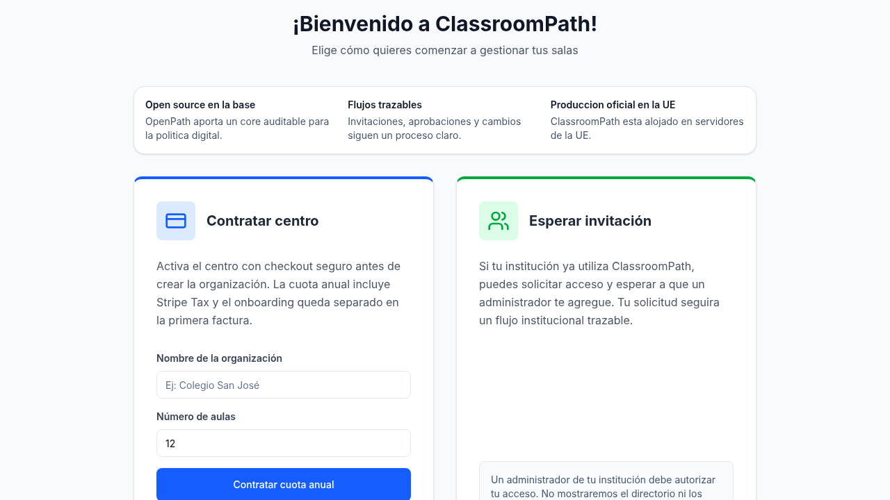
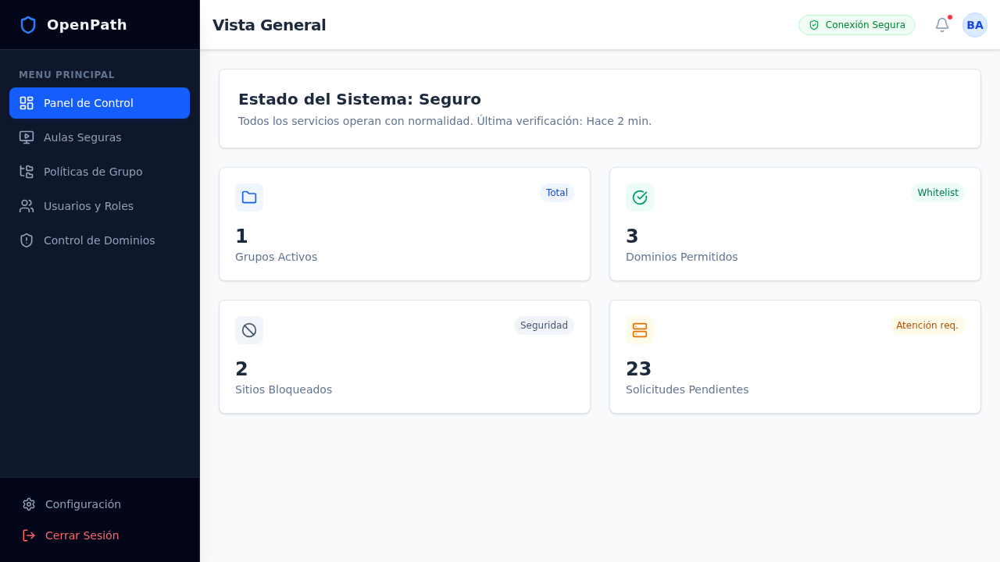

# ClassroomPath

> Status: maintained
> Applies to: product overview, local development, and release workflow
> Last verified: 2026-04-13
> Source of truth: `README.md`

ClassroomPath is the managed service built on top of [OpenPath](https://github.com/balejosg/openpath) for schools that need intentional internet access without turning day-to-day operations into another IT burden.
It adds organization-aware onboarding, delegated administration, deployment workflows, and operational contracts on top of the OpenPath OSS core.

Use ClassroomPath when you need:

- a buyer-friendly route to demo, pilot, or pricing
- an auditable core instead of a black-box filtering product
- organization-scoped onboarding and delegated administration
- a managed path before deciding whether long-term self-operation makes sense



## Documentation

- Canonical documentation index: [`docs/INDEX.md`](docs/INDEX.md)
- Agent workflow and environment routing: [`AGENTS.md`](AGENTS.md)
- Staging deploy runbook: [`docs/runbooks/deploy-staging.md`](docs/runbooks/deploy-staging.md)
- Production deploy runbook: [`docs/runbooks/deploy-production.md`](docs/runbooks/deploy-production.md)

## Start Evaluating

- Security and trust overview: [`docs/evaluation/security-trust.md`](docs/evaluation/security-trust.md)
- Claims and evidence map: [`docs/evaluation/claims-and-evidence.md`](docs/evaluation/claims-and-evidence.md)
- Compatibility matrix: [`docs/evaluation/compatibility-matrix.md`](docs/evaluation/compatibility-matrix.md)
- IT evaluation checklist: [`docs/evaluation/it-evaluation-checklist.md`](docs/evaluation/it-evaluation-checklist.md)
- Pilot runbook: [`docs/evaluation/pilot-runbook.md`](docs/evaluation/pilot-runbook.md)
- IT objections FAQ: [`docs/evaluation/faq-it-objections.md`](docs/evaluation/faq-it-objections.md)
- OpenPath vs. ClassroomPath: [`docs/evaluation/openpath-vs-classroompath.md`](docs/evaluation/openpath-vs-classroompath.md)
- Spanish guide for school IT teams: [`docs/evaluation/es/guia-evaluacion-centros.md`](docs/evaluation/es/guia-evaluacion-centros.md)
- Demo, pilot, and pricing route: [classroompath.eu](https://classroompath.eu/)

## Why IT Teams Trust The Evaluation Path

- **Open core, managed service:** OpenPath remains public and auditable while ClassroomPath adds the managed service layer.
- **Documented session boundary:** sensitive auth material stays in cookie-backed sessions and mutation requests enforce origin checks. See [`docs/SESSION_SECURITY_MODEL.md`](docs/SESSION_SECURITY_MODEL.md).
- **Controlled wrapper boundary:** the product wraps the OpenPath SPA through the documented public surface rather than deep imports into unstable internals.
- **Visible operational discipline:** staging and production promotion paths are documented in this repo, with `main` promoted to staging and `v*` tags reserved for production.

## What ClassroomPath Adds

- Organization-scoped onboarding, invitations, and approval flows
- Tenant-specific user, classroom, and group management
- Durable cross-system orchestration for mutations that span ClassroomPath and upstream OpenPath
- A release workflow that promotes `main` to staging first and production by `v*` tags only
- A bounded wrapper over the OpenPath React SPA public surface

## OpenPath vs. ClassroomPath

| Product         | Role                                                                                                              |
| --------------- | ----------------------------------------------------------------------------------------------------------------- |
| `OpenPath`      | OSS core for endpoint enforcement, policy data, browser integration, and the shared UI foundation                 |
| `ClassroomPath` | SaaS wrapper that adds tenancy, billing/onboarding policy, deploy automation, and environment-specific operations |

## Product And Licensing Model

ClassroomPath is distributed under the ClassroomPath Source-Available License 1.0.

This repository is published for transparency, auditability, and private modification, but it does **not** grant the right to reproduce or operate the production service without written permission.

Key boundary:

- source access for review, audit, and private modification
- local private development and test use only
- no production use or self-hosting
- no redistribution, white-labeling, SaaS resale, or hosted replicas
- separate licensing for [OpenPath](https://github.com/balejosg/openpath), which remains under `AGPL-3.0-or-later`

## Live URLs

Machine-readable source of truth: [`config/deploy-targets.json`](config/deploy-targets.json)

| Environment    | URL                       | Deploy Trigger           |
| -------------- | ------------------------- | ------------------------ |
| **Production** | https://classroompath.eu  | Git tag `v*`             |
| **Staging**    | http://192.168.1.114:3000 | `npm run deploy:staging` |



## Architecture

Runtime shape:

- `gateway` is the public entrypoint and owns `/cp/*`
- OpenPath API stays internal to the Docker network and is exposed through controlled gateway passthroughs
- the public hostnames and health endpoints are centralized in `config/deploy-targets.json`
- ClassroomPath wraps the OpenPath React SPA through the documented public surface, not deep imports into upstream internals

## Multi-Tenancy

ClassroomPath persists tenancy and orchestration data in `cp_*` tables while continuing to rely on
OpenPath for upstream policy entities and endpoint-facing behavior. The canonical details live in:

- [`docs/contracts/cross-system-mutations.md`](docs/contracts/cross-system-mutations.md)
- [`docs/contracts/routes-ports.md`](docs/contracts/routes-ports.md)
- [`docs/SESSION_SECURITY_MODEL.md`](docs/SESSION_SECURITY_MODEL.md)

## Quick Start (Development)

1. Clone with submodules.

```bash
git clone --recurse-submodules https://github.com/balejosg/ClassroomPath.git
cd ClassroomPath
```

2. Install workspace dependencies.

```bash
npm run install:all
```

3. Create local config files from examples.

```bash
cp config/.env.example config/.env
cp .env.local.example .env.local
# Edit config/.env with your values
# Edit .env.local only if you will use the staging deploy workflow
```

4. Build and run the local stack.

```bash
docker compose -f docker/docker-compose.yml up -d --build
```

## Verification

Normal git workflow:

- `.husky/pre-commit` runs `npm run verify:commit`
- `.husky/pre-push` enforces trunk policy only
- use manual verification commands when you need targeted confidence outside the hook flow

Manual lanes:

```bash
npm run test:deployment
npm run test:e2e:full
npm run test:e2e:mobile
npm run verify:release
```

## Deployment

Staging promotion:

```bash
git push origin main
npm run deploy:staging
```

Production promotion:

```bash
git tag v1.0.1
git push origin v1.0.1
```

Use the maintained runbooks for the full workflow:

- [`docs/runbooks/deploy-staging.md`](docs/runbooks/deploy-staging.md)
- [`docs/runbooks/deploy-production.md`](docs/runbooks/deploy-production.md)
- [`docs/runbooks/update-openpath-submodule.md`](docs/runbooks/update-openpath-submodule.md)
- [`docs/runbooks/configure-stripe-billing.md`](docs/runbooks/configure-stripe-billing.md)

## Updating OpenPath

```bash
npm run submodule:update
git add upstream/openpath
git commit -m "chore: update openpath submodule"
git push origin main
npm run deploy:staging
```

## License

See `LICENSE` for the full ClassroomPath Source-Available License 1.0 terms.
